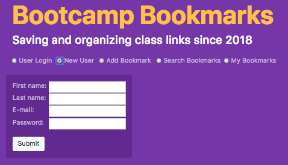
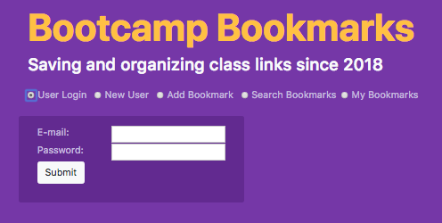
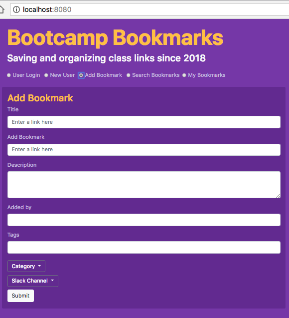
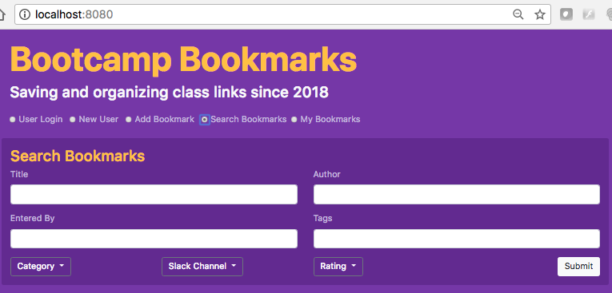
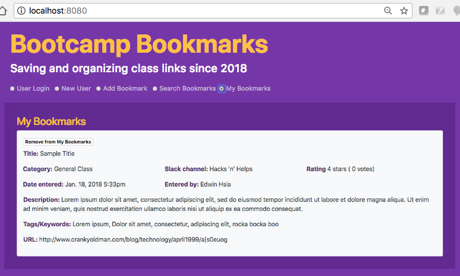
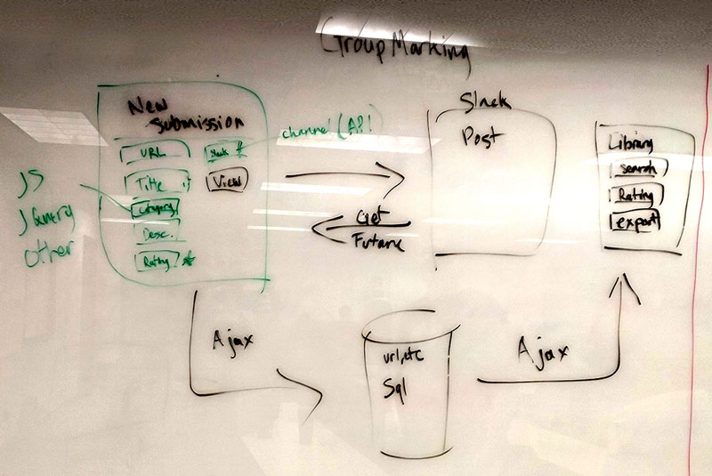
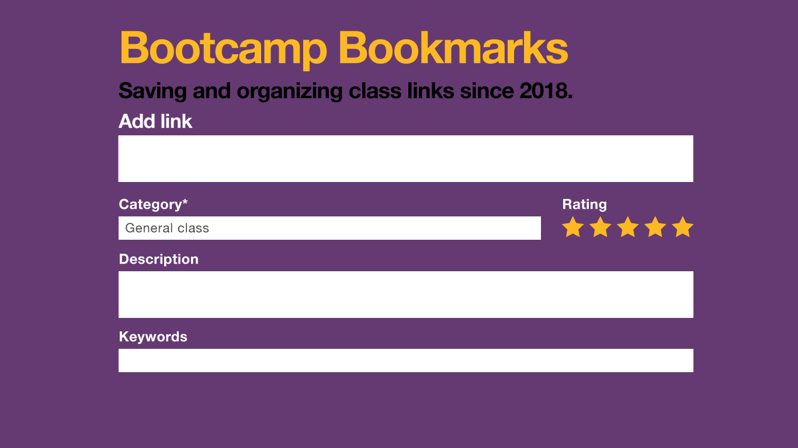
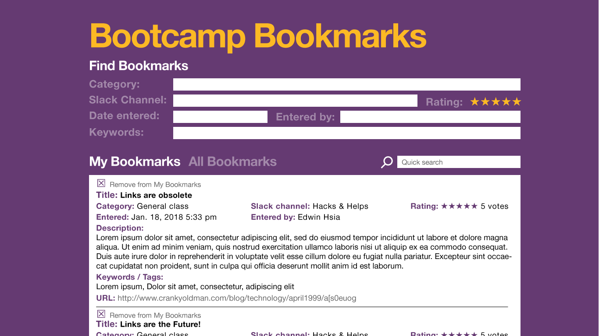
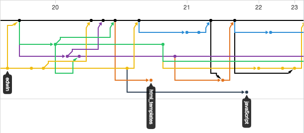

# Bootcamp Bookmarks
### Overview
"Saving and organizing class links since 2018"

* Slideshow: <https://docs.google.com/presentation/d/1xRopCPKcVSlhMiHDQItKIKUQ8UfsvuNpnmbGcY82i5c/edit#slide=id.g38de8eda4e_2_80>

* Github: <https://github.com/DMoldenhauer/Bookmarks>

### App screenshots

### Motivation & Concept
* To somehow create a “library” of all the Slack hacks & helps, that allows a user to search and save.
* Older messages get lost 
* Organizing ALL the information
* Duplicate records
* Ability to know more than just url (like bkmk)
* Integration of Slack API

### Design Process
##### Wireframing

##### Mock-up

* Photoshop/Illustrator screen images

* Built HTML Bootstrap page with interface panel divs (jquery radio nav buttons to show/hide - likely won't be needed in finalized app)

* HTML interface panels moved into Handlebars (index & partial files)

### Technologies Used
* HTML, CSS, Javascript, Jquery, Bootstrap, SQL, Node, NPM, Express, Sequelize, Handlebars
* MVC framework
* Postman for back-end testing

### Team Roles
##### Edwin: FRONT END 
* Github coordination | Handlebars | Link APIs to DOM 

##### Joe: FRONT END
* UI Design/Mockups | HTML/CSS | PowerPoint

##### Don: BACK END 

* API Routing | Server | Sequelize

##### Laurie: BACK END
* Project outline | MySQL DB | Models

### Future Development 
* Deeper search functionality (more than one field)
* Add rating system 
* Pull several of the fields from URLs (like Title)
* Pull directly from Slack (links & info) using Slack API
* User authentication
* Ability to formalize tagging system

### Lessons Learned

* Github "spaghetti" 
* Project Management and System Architecture assistance  would have helped
* Unit Testing was important
* Managed to Cooperate when despite strong opinions
* Communication was important, could be improved
* Critical to make sure team is all on the same page and reconnect frequently
* Making a copy locally can save time

